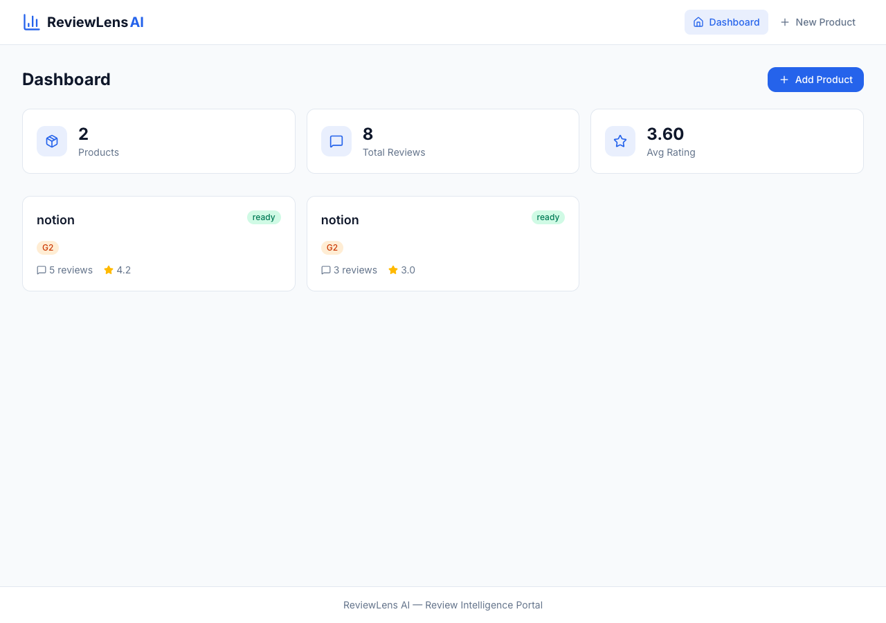
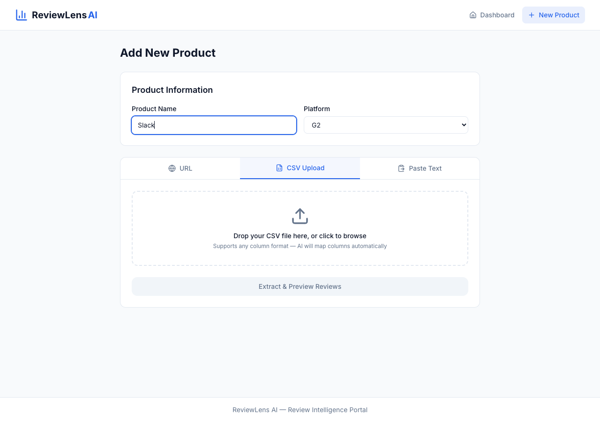
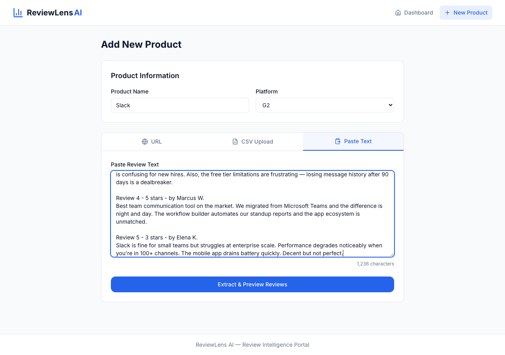
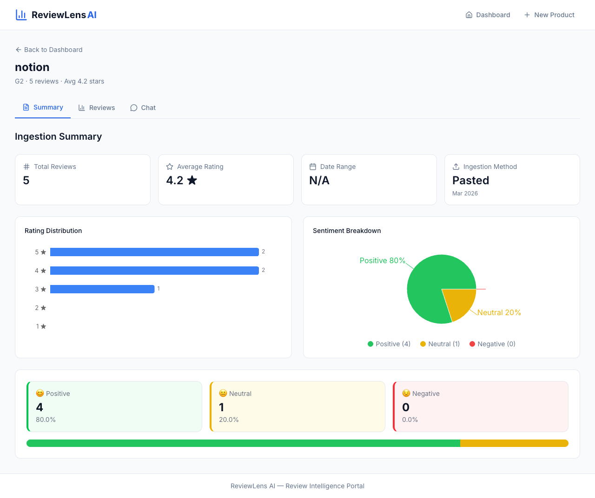
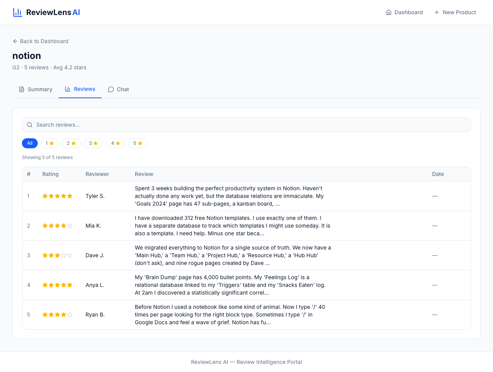
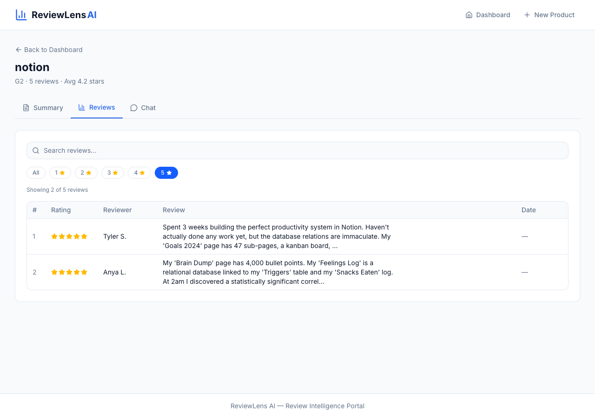
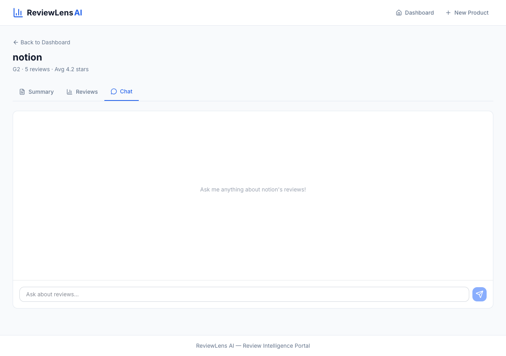
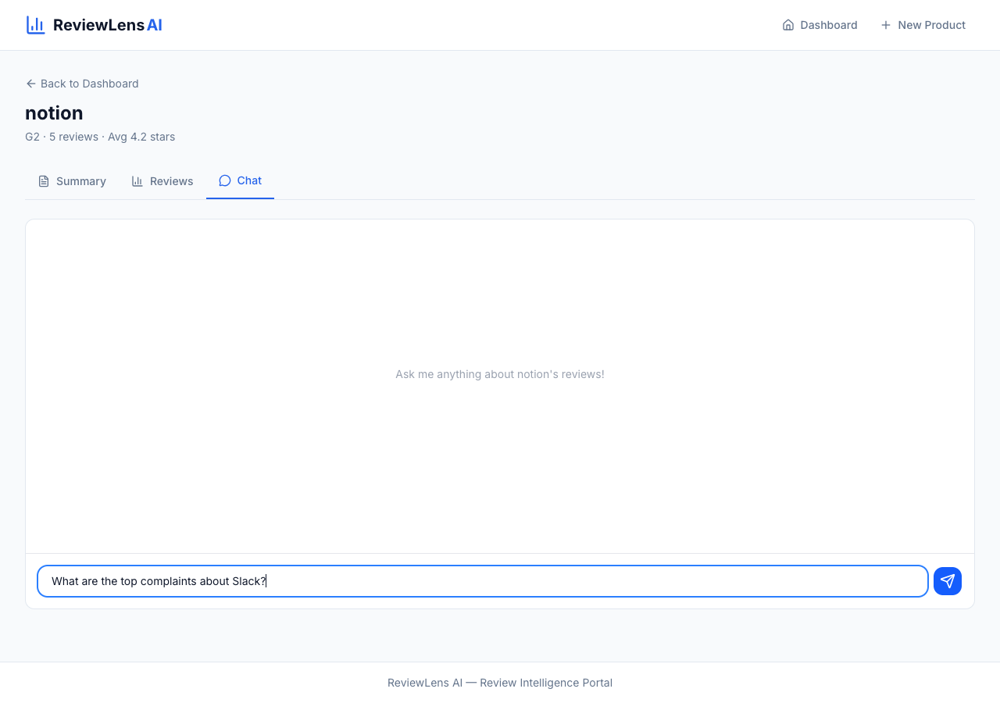
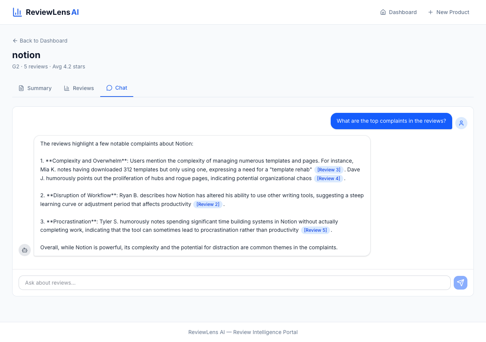
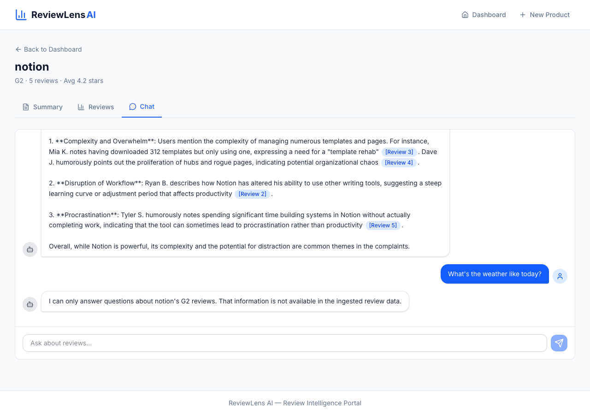

# ReviewLens AI — User Workflow Guide

> This document walks through the complete user journey of ReviewLens AI,
> from landing on the dashboard to querying reviews through the AI chat interface.
> Each step includes a screenshot from the live application with real data.

**Live URL:** https://reviewlens.vercel.app

---

## Workflow Overview

```
Dashboard → Add Product → Paste/Upload Reviews → AI Extraction → Preview & Confirm
    ↓                                                                    ↓
View Product ← ← ← ← ← ← ← ← ← ← ← ← ← ← ← ← ← ← ← ← ← ← ← ←
    ├── Summary Tab (stats, rating distribution, sentiment)
    ├── Reviews Tab (search, filter, paginate)
    └── Chat Tab (guardrailed RAG Q&A with citations)
```

---

## Step 1 — Dashboard Overview

**Screenshot:** `screenshots/progress_1/workflow_demo/01-dashboard-overview.png`



The Dashboard is the landing page. It displays:

- **Stats bar** — total products tracked, total reviews ingested, and aggregate average rating across all products.
- **Product cards** — each card shows the product name, platform badge (e.g. G2), review count, average rating, and a status indicator (`ingesting` / `ready` / `error`).
- **"+ Add Product" button** — opens the ingestion wizard (same as the "New Product" nav link).

The analyst gets an at-a-glance view of their entire review portfolio before drilling into any single product.

---

## Step 2 — Add New Product: Enter Product Information

**Screenshot:** `screenshots/progress_1/workflow_demo/02-new-product-info.png`



Clicking **"+ Add Product"** or **"New Product"** navigates to the ingestion wizard.

1. **Product Name** — type the product name (e.g. "Slack").
2. **Platform** — select the review platform from the dropdown: G2, Amazon, Google Maps, Yelp, or Capterra.
3. **Ingestion method tabs** — choose one of three input methods:
   - **URL** — paste a public review page URL (subject to anti-bot limitations)
   - **CSV Upload** — drag-and-drop or browse for a CSV file; AI auto-maps columns
   - **Paste Text** — paste raw review text directly

---

## Step 3 — Paste Reviews with Real Data

**Screenshot:** `screenshots/progress_1/workflow_demo/03-paste-reviews-input.png`



In this example, the analyst pastes 5 Slack reviews from G2 directly into the text area. The reviews include:

- Reviewer names, star ratings, and detailed review text
- A mix of 5-star, 4-star, 3-star, and 2-star reviews for realistic sentiment distribution
- A character counter at the bottom confirms 1,236 characters of input

The analyst clicks **"Extract & Preview Reviews"** to send the raw text to the AI extraction Edge Function. OpenAI GPT-4o uses function-calling to parse the unstructured text into structured `{reviewer_name, rating, review_text, review_date}` objects.

---

## Step 4 — Review Preview & Confirm

> **Note:** The preview step (Step 2 in the app's 3-step wizard) shows the AI-extracted reviews in an editable table before committing to the database. The analyst can verify, edit, or remove individual reviews before final ingestion.

After extraction, the system displays:
- Parsed reviews in a table with columns: Reviewer, Rating (stars), Review Text, Date
- An edit button per row to correct any extraction errors
- A **"Confirm & Ingest"** button that triggers the full pipeline:
  1. Creates the product record in Postgres
  2. Inserts all reviews into the `reviews` table
  3. Calculates and stores `rating_distribution` and `average_rating`
  4. Calls the `embed-reviews` Edge Function to vectorize all reviews into Pinecone
  5. Redirects to the Product Detail page once status flips to `ready`

---

## Step 5 — Product Detail: Summary Tab

**Screenshot:** `screenshots/progress_1/workflow_demo/05-product-summary.png`



After ingestion completes, the analyst lands on the Product Detail page with three tabs. The **Summary tab** provides:

- **Stats tiles** — Total Reviews (5), Average Rating (4.2 ★), Date Range, and Ingestion Method (Pasted, Mar 2026)
- **Rating Distribution chart** — vertical bar chart showing the count and percentage breakdown across 1–5 stars
- **Sentiment Breakdown** — pie chart dividing reviews into Positive (rating ≥ 4), Neutral (rating = 3), and Negative (rating ≤ 2), with legend showing counts
- **Sentiment cards** — three colored cards showing Positive (4 reviews, 80%), Neutral (1 review, 20%), Negative (0 reviews, 0%) with a stacked progress bar

This gives the analyst an instant quantitative snapshot of the product's review health.

---

## Step 6 — Product Detail: Reviews Tab

**Screenshot:** `screenshots/progress_1/workflow_demo/06-reviews-table.png`



The **Reviews tab** provides a searchable, filterable review table:

- **Search bar** — full-text search across all review content
- **Star filter pills** — click "All", "1★", "2★", "3★", "4★", or "5★" to filter by rating
- **Review table** — columns for #, Rating (visual stars), Reviewer, Review text (truncated with "..." for long reviews, expandable on click), and Date
- **Pagination** — shows "Showing X of Y reviews" with 10 reviews per page

The analyst can quickly scan reviews, search for specific topics (e.g. "template", "integration"), or filter to see only negative feedback.

---

## Step 7 — Reviews Tab: Star Filtering

**Screenshot:** `screenshots/progress_1/workflow_demo/07-reviews-filtered-5star.png`



Clicking the **"5 ★"** filter pill narrows the table to show only 5-star reviews. The counter updates to "Showing 2 of 5 reviews", confirming the filter is active. The "5 ★" pill is highlighted in blue to indicate the active filter.

This enables analysts to quickly isolate top praise or worst complaints by rating.

---

## Step 8 — Product Detail: Chat Tab (Empty State)

**Screenshot:** `screenshots/progress_1/workflow_demo/08-chat-empty.png`



The **Chat tab** provides a conversational Q&A interface. When first opened, it shows:

- A welcoming empty state message: "Ask me anything about notion's reviews!"
- A text input with placeholder "Ask about reviews..." and a send button
- The chat is only available when the product status is `ready` (embeddings complete)

---

## Step 9 — Chat: Typing a Question

**Screenshot:** `screenshots/progress_1/workflow_demo/09-chat-question-typed.png`



The analyst types a question into the chat input. In this example: **"What are the top complaints about Slack?"** — this intentionally asks about a different product to test the scope guard.

---

## Step 10 — Chat: AI-Grounded Response with Citations

**Screenshot:** `screenshots/progress_1/workflow_demo/10-chat-ai-response.png`



When the analyst asks a valid, on-topic question like **"What are the top complaints in the reviews?"**, the RAG pipeline activates:

1. The question is embedded via `text-embedding-3-small`
2. Pinecone retrieves the 8 most relevant review chunks from the product's namespace
3. GPT-4o generates a grounded answer using only the retrieved context

The response demonstrates key RAG features:
- **Structured analysis** — complaints organized into categories (Complexity, Workflow Disruption, Procrastination)
- **Citation badges** — every claim is backed by `[Review 3]`, `[Review 4]`, `[Review 2]`, `[Review 5]` references, shown as blue highlighted badges
- **Grounded content** — the AI only references information from the actual ingested reviews
- **Streaming delivery** — the response appears token-by-token via SSE streaming

---

## Step 11 — Chat: Scope Guard in Action

**Screenshot:** `screenshots/progress_1/workflow_demo/11-chat-scope-guard.png`



When the analyst asks an out-of-scope question like **"What's the weather like today?"**, the two-layer scope guard activates:

- **Layer 1 (Structural):** Pinecone namespace isolation — the model can only retrieve vectors from this product's `product-{uuid}` namespace, which contains no weather data
- **Layer 2 (Instructional):** The system prompt enforces a strict decline script

The AI responds: *"I can only answer questions about notion's G2 reviews. That information is not available in the ingested review data."*

This guardrail ensures the AI never hallucinates or drifts outside the ingested dataset, which is a core requirement for ORM analysts who need trustworthy, data-grounded insights.

---

## End-to-End Workflow Summary

| Step | Action | Time |
|------|--------|------|
| 1 | View Dashboard overview | Instant |
| 2 | Click "+ Add Product", enter name & platform | ~5 sec |
| 3 | Paste or upload reviews | ~10 sec |
| 4 | AI extracts structured reviews, analyst previews & confirms | ~15 sec |
| 5 | View Ingestion Summary (stats, charts, sentiment) | Instant |
| 6 | Browse reviews in searchable/filterable table | Instant |
| 7 | Filter by star rating to isolate feedback segments | Instant |
| 8–11 | Ask questions via Chat, get cited answers or scope-guard declines | ~5 sec per question |

**Total time from raw reviews to AI-powered insights: under 1 minute.**

---

## Screenshot Inventory

| # | File | Description |
|---|------|-------------|
| 01 | `01-dashboard-overview.png` | Dashboard with stats and product cards |
| 02 | `02-new-product-info.png` | New Product form with "Slack" entered |
| 03 | `03-paste-reviews-input.png` | Paste Text tab with 5 real reviews |
| 05 | `05-product-summary.png` | Summary tab: stats, rating distribution, sentiment |
| 06 | `06-reviews-table.png` | Reviews tab: full table with 5 reviews |
| 07 | `07-reviews-filtered-5star.png` | Reviews filtered to 5★ (2 of 5 shown) |
| 08 | `08-chat-empty.png` | Chat empty state |
| 09 | `09-chat-question-typed.png` | Chat with typed question |
| 10 | `10-chat-ai-response.png` | RAG response with [Review N] citations |
| 11 | `11-chat-scope-guard.png` | Scope guard declining off-topic question |
