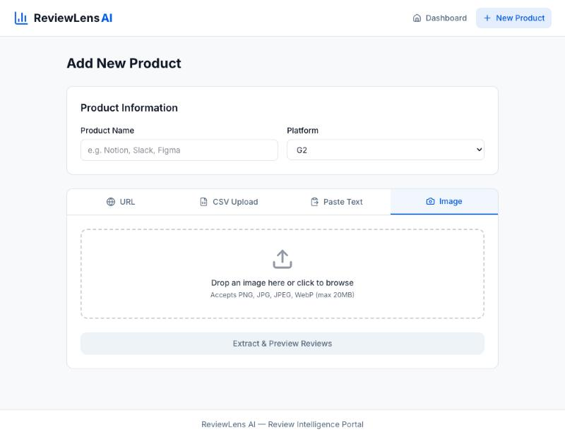
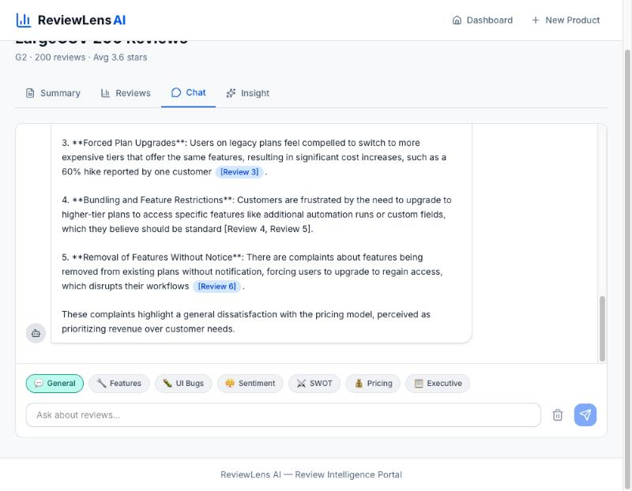
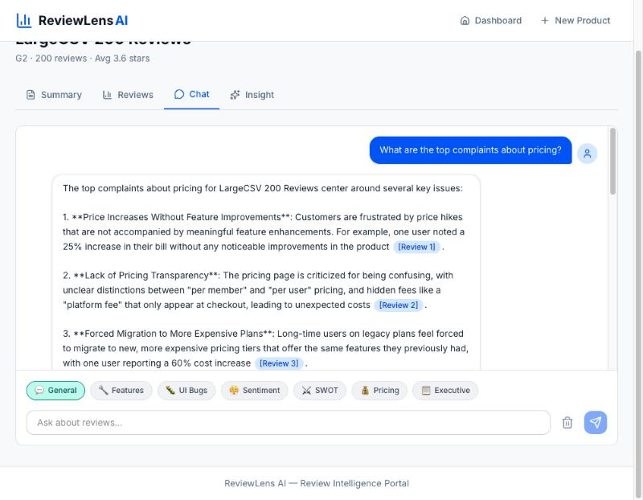
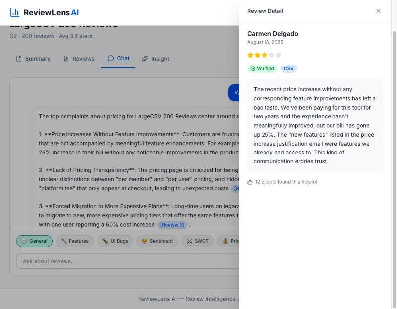
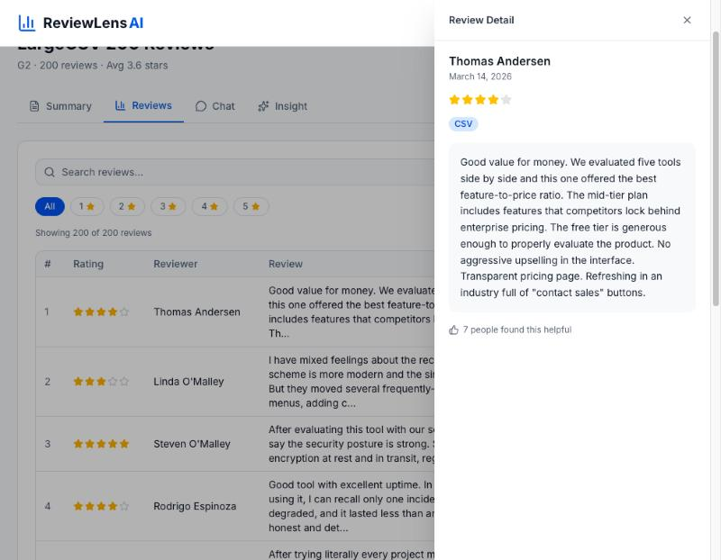
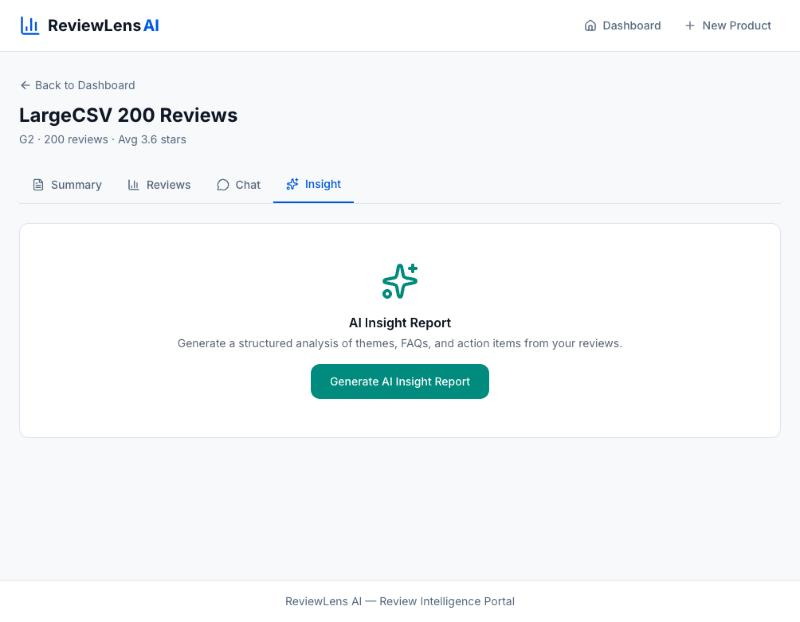
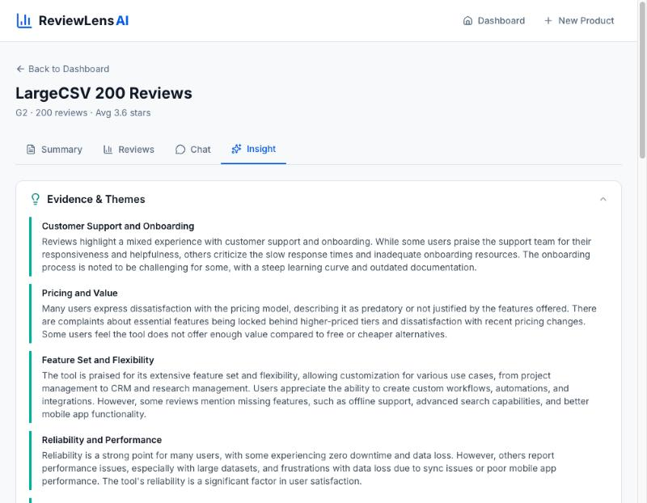
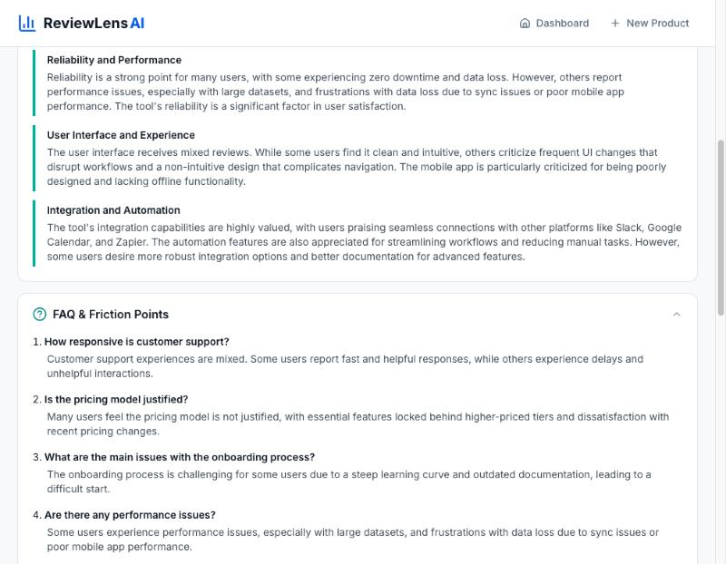
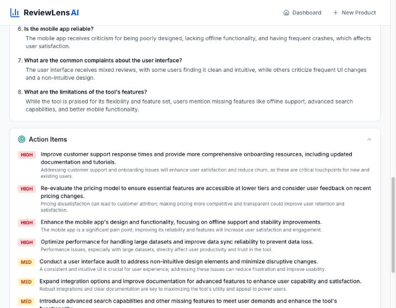
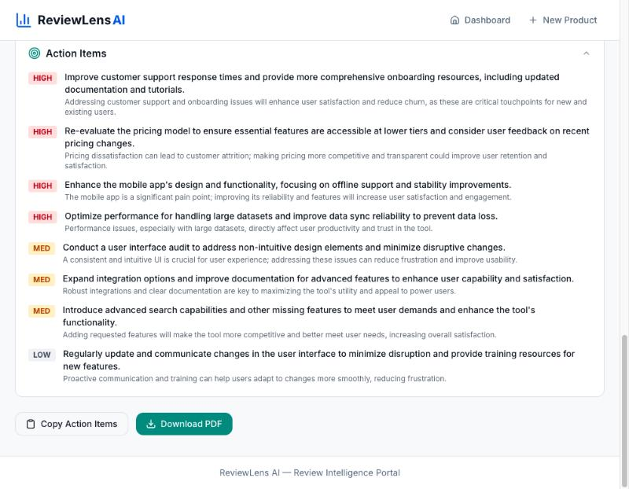

# Progress 2 — User Workflow Guide

> This document walks through the P2 features added to ReviewLens AI.
> Each workflow includes a screenshot from the live application with real data.

**Live URL:** https://review-lens-ai-five.vercel.app/

---

## P2 Workflow Overview

```
New Product Wizard (P2 adds Image tab)
    │
    ├── URL / CSV / Paste (P1)
    └── Image ──► GPT-4o Vision extraction                          [NEW]
                        │
                Product Detail Page
    ├── Summary Tab (P1)
    ├── Reviews Tab (P1) ──► Row click → Evidence Drawer             [NEW]
    ├── Chat Tab (P1)
    │       ├── Skill Selector (7 analytical lenses)                 [NEW]
    │       ├── Citation badges [Review N] → Evidence Drawer         [NEW]
    │       └── Per-skill conversation persistence                   [NEW]
    └── Insight Tab ──► 3-worker agentic report + PDF export         [NEW]
```

---

## Workflow 1 — Image Ingestion Tab

**Screenshot:** `screenshots/progress_2/workflow_demo/01-image-tab.jpg`



P2 adds a fourth ingestion method tab — **Image** — to the New Product wizard. The Image tab provides:

- **Drag-and-drop zone** — accepts PNG, JPG, JPEG, and WebP files up to 20MB
- **GPT-4o Vision extraction** — the uploaded image is sent to GPT-4o's vision endpoint, which reads all visible review text, ratings, reviewer names, and dates from the screenshot
- **Source tracking** — reviews extracted via image are tagged with `source_modality: "image"` and the original filename is stored in `source_file_name`
- **Same preview flow** — after extraction, the analyst reviews the parsed data in the same editable preview table used by CSV and Paste, then clicks "Confirm & Ingest" to save

This enables analysts to ingest reviews from sources that don't offer CSV export or API access — simply screenshot the review page and upload.

---

## Workflow 2 — Chat with Skill Selector

**Screenshot:** `screenshots/progress_2/workflow_demo/02-chat-skill-selector.jpg`



P2 adds a **Skill Selector** — a horizontal scrollable row of 7 pill buttons rendered above the chat input. Each skill injects a specialized system prompt directive that shapes the AI's analytical lens:

| Skill | Purpose |
|-------|---------|
| **General** (default) | Open-ended analysis, no injection |
| **Features** | Extract requested/praised features by frequency and urgency |
| **UI Bugs** | Surface interface friction, broken flows, exact error quotes |
| **Sentiment** | Classify reviewer tone: Aggressive → Frustrated → Neutral → Satisfied → Evangelist |
| **SWOT** | Build a SWOT matrix from competitor mentions in reviews |
| **Pricing** | Isolate price, cost, value, and refund mentions |
| **Executive** | Top 3 insights in plain language, max 200 words |

The active skill is highlighted with a teal border. Switching skills **saves** the current conversation and loads the new skill's saved history, so each analytical lens maintains its own independent thread. The screenshot shows the General skill active with a pricing query and AI response including citation badges.

---

## Workflow 3 — Citation Badges and Evidence Drawer

### From Chat (Citation Click)

**Screenshot:** `screenshots/progress_2/workflow_demo/03-chat-citations.jpg`



When the AI answers a question, it includes inline **citation badges** like `[Review 1]`, `[Review 2]` rendered as clickable blue pills. Each badge maps to a specific review from the Pinecone retrieval context. The screenshot shows a pricing complaints query with citations linking to specific reviewer evidence (e.g., Review 1 for price increases, Review 2 for pricing transparency).

### Evidence Drawer (from Chat)

**Screenshot:** `screenshots/progress_2/workflow_demo/04-evidence-drawer-chat.jpg`



Clicking a citation badge opens the **Evidence Drawer** — a fixed right-side panel (`z-50`) that slides in with a Framer Motion animation and semi-transparent backdrop. The drawer displays:

- **Reviewer name** — e.g., "Carmen Delgado"
- **Review date** — e.g., "August 13, 2025"
- **Visual star rating** — filled and empty stars (3 out of 5 shown)
- **Verified badge** — green "Verified" checkmark if the reviewer is a verified purchaser
- **Source badge** — "CSV" (teal), "Paste", "URL", or "Image" indicating the ingestion method
- **Full review text** — complete, untruncated review content in a light blue card
- **Helpful count** — "12 people found this helpful"

Close the drawer via the X button, backdrop click, or Escape key.

### Evidence Drawer (from Reviews Table)

**Screenshot:** `screenshots/progress_2/workflow_demo/05-evidence-drawer-table.jpg`



The same Evidence Drawer opens when clicking any row in the **Reviews tab** table. The screenshot shows the Reviews table with 200 reviews (star filter pills, search bar, paginated table) alongside the drawer opened for Thomas Andersen's 4-star review. This provides a second entry point to the full review detail — analysts can browse the table and click any row to see the complete text, source badge, and helpful count without leaving the page.

---

## Workflow 4 — AI Insight Report

The **Insight** tab (4th tab on the Product Detail page) provides a structured executive strategy document generated by a 3-worker agentic pipeline.

### Empty State

**Screenshot:** `screenshots/progress_2/workflow_demo/06-insight-empty.jpg`



When the Insight tab is first opened, a centered empty state shows:

- **Sparkles icon** — animated teal icon indicating AI-powered analysis
- **"AI Insight Report"** title and description: "Generate a structured analysis of themes, FAQs, and action items from your reviews"
- **"Generate AI Insight Report"** button (teal, enabled when product status is "ready")

Clicking the button triggers the 3-worker agentic pipeline, which shows a loading animation with progress steps:
- Step 1 of 3: "Gathering evidence from reviews..."
- Step 2 of 3: "Analysing themes..."
- Step 3 of 3: "Building action plan..."

### Section 1 — Evidence & Themes

**Screenshot:** `screenshots/progress_2/workflow_demo/07-insight-themes.jpg`



The first section of the generated report shows up to 6 MECE themes extracted from the reviews. Each theme has:

- **Bold title** — e.g., "Customer Support and Onboarding", "Pricing and Value", "Feature Set and Flexibility"
- **Summary paragraph** — a synthesized overview of what reviewers said about this topic
- **Teal left border accent** — visual hierarchy separating each theme block

The section is collapsible via the chevron icon in the header.

### Section 2 — FAQ & Friction Points

**Screenshot:** `screenshots/progress_2/workflow_demo/08-insight-faq.jpg`



The second section presents up to 8 common user questions with synthesized answers. Each item has:

- **Bold numbered question** — e.g., "How responsive is customer support?", "Is the pricing model justified?"
- **Gray answer text** — a balanced summary drawn from multiple reviews
- The questions surface recurring friction points that a product team should address

### Section 3 — Action Items

**Screenshot:** `screenshots/progress_2/workflow_demo/09-insight-actions.jpg`



The third section provides up to 10 prioritized product action items with:

- **Priority badges** — **HIGH** (red), **MED** (amber), **LOW** (gray) indicating urgency
- **Bold action title** — a specific, actionable recommendation (e.g., "Improve customer support response times")
- **Gray rationale** — explains why this action matters based on the review evidence

### Export Options

**Screenshot:** `screenshots/progress_2/workflow_demo/10-insight-export.jpg`



At the bottom of the report, two export buttons are available:

- **Copy Action Items** — copies a formatted checklist of all action items to the clipboard, ready to paste into project management tools
- **Download PDF** — generates and downloads a formatted PDF document via jsPDF containing all three report sections

---

## Workflow 5 — Large CSV Ingestion

Upload a CSV file with 200+ reviews for instant processing.

1. Navigate to **+ New Product** page
2. Enter product name and select platform
3. On the **CSV Upload** tab (default), drag and drop a CSV file
4. The system detects standard column headers automatically:
   - Supported columns: reviewer_name, rating, review_text, review_date, verified, helpful_count
   - Also recognizes aliases: name/author, stars/score, comment/feedback, etc.
5. Click **"Extract & Preview Reviews"**
6. Direct column mapping processes the CSV instantly — no LLM API call needed
7. For non-standard column names, the system falls back to GPT-4o extraction in 50-row batches
8. Review the extracted data in the preview table (paginated for large datasets)
9. Click **"Confirm & Ingest N Reviews"** to save all reviews and embed in Pinecone
10. Redirected to product page — all reviews visible in the Reviews tab

---

## Workflow 6 — Chat Persistence

Chat conversations are preserved across tab switches and page navigation.

1. Navigate to a product page and open the **Chat** tab
2. Send one or more messages — the AI responds with streaming text and citations
3. Switch to the **Summary** or **Reviews** tab
4. Switch back to the **Chat** tab — all messages and citations are still displayed
5. Conversations are saved per product + skill combination:
   - Switching from General to Sentiment saves the General conversation
   - The Sentiment skill loads its own saved history (or empty state if new)
   - Switching back to General restores the General conversation
6. To clear a conversation, click the **trash icon** next to the send button
7. Conversations persist across page refreshes (stored in localStorage)

---

## Screenshot Inventory

| # | File | Description |
|---|------|-------------|
| 01 | `01-image-tab.jpg` | New Product wizard with Image tab active — drag-drop zone for review screenshots |
| 02 | `02-chat-skill-selector.jpg` | Chat tab with 7-skill selector pills, General active, AI response with citations |
| 03 | `03-chat-citations.jpg` | Chat response showing inline [Review N] citation badges from pricing query |
| 04 | `04-evidence-drawer-chat.jpg` | Evidence Drawer opened from [Review 1] citation — Carmen Delgado, 3 stars, verified, CSV source |
| 05 | `05-evidence-drawer-table.jpg` | Evidence Drawer opened from Reviews table row — Thomas Andersen, 4 stars, full review text |
| 06 | `06-insight-empty.jpg` | Insight tab empty state — sparkles icon, title, and Generate button |
| 07 | `07-insight-themes.jpg` | Insight Report Section 1 — Evidence & Themes with teal-bordered theme cards |
| 08 | `08-insight-faq.jpg` | Insight Report Section 2 — FAQ & Friction Points, numbered Q&A list |
| 09 | `09-insight-actions.jpg` | Insight Report Section 3 — Action Items with HIGH/MED/LOW priority badges |
| 10 | `10-insight-export.jpg` | Insight Report export — Copy Action Items and Download PDF buttons |
